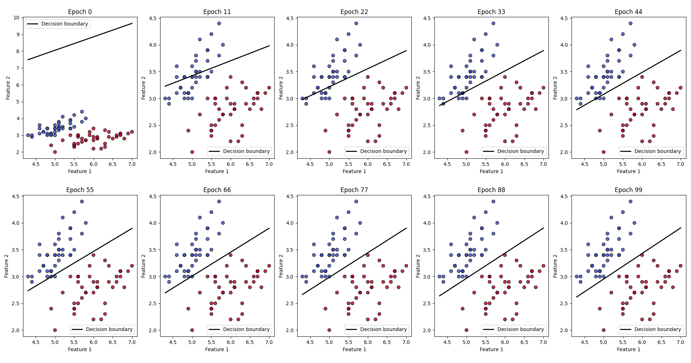
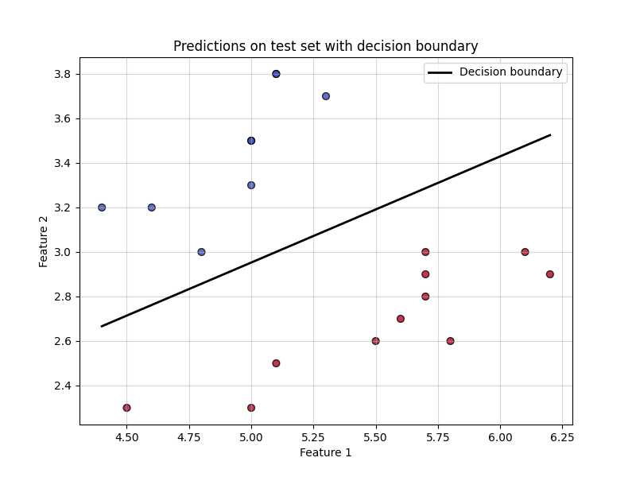

# Iris binary classification model
This project implements a simple binary classification model using logistic regression to classify two species of the Iris dataset: **Iris-setosa** and **Iris-versicolor**. The model uses the first two features of the dataset (*sepal length* and *sepal width*) and is trained using gradient descent.

## Features
- Binary classification of two Iris species.
- Visualizes the decision boundary during training and testing.
- Evaluates model accuracy on the test set.
- Fully modular code for ease of reuse and modification.

## Dataset
The code uses the [Iris dataset](https://archive.ics.uci.edu/dataset/53/iris), which contains measurements of 150 flowers from three species:
- **Iris-setosa**
- **Iris-versicolor**
- **Iris-virginica**

### Data used in this project
For this binary classification task:
- **Iris-setosa** is labeled as `0`.
- **Iris-versicolor** is labeled as `1`.
- The first two features are used:
    - Sepal length (in cm)
    - Sepal width (in cm)

## Dependencies
The following Python libraries are required to run the code:
- `numpy`
- `pandas`
- `matplotlib`
### Installation
```python
pip install numpy pandas matplotlib
```

## Code analysis
### Data loading and preprocessing
The dataset is loaded from the `iris.data` file. Only the first two features and two classes are used.
- `load_data(file_name)`
  Splits the dataset into:
    - **Training set**: 80% of the data (40 samples of each class).
    - **Test set**: 20% of the data (10 samples of each class).

### Model Initialization
The model is initialized with random weights and a bias.
- `initialize_parameters(features)`
	- Random values for weights and bias are generated within the range $[-0.5, 0.5]$.
	- A weight is generated for each feature.

### Model Training
The model is trained using gradient descent for a specified number of epochs. The training process visualizes the decision boundary at 10 evenly spaced epochs.

- `train_model(x_train, y_train, weights, bias, epochs, eta)`

### **Activation**
The model's activation is calculated as:

>$$y = \sigma(w \cdot x + b)$$

Where:
- $\sigma(z) = \frac{1}{1 + e^{-z}}$​ is the sigmoid function.
- $w$: Weight vector.
- $x$: Input features.
- $b$: Bias.

### **Gradient**
The gradient of the error with respect to the prediction is given by:

>$$\text{gradient} = (y - y_{\text{expected}}) \cdot y \cdot (1 - y)$$

Where:
- $y_{\text{expected}}$​: Expected value (target).
- $y$: Predicted output.

#### Weight Update
Weights are updated according to the gradient rule:
>$$w \leftarrow w - \eta \cdot \frac{1}{N} \cdot (x^T \cdot \text{gradient})$$

Where:
- $\eta$: Learning rate.
- $N$: Number of samples in the batch.
- $x^T$: Transpose of the input matrix.

### **4. Bias Update**

The bias is updated as:

>$$b \leftarrow b - \eta \cdot \frac{1}{N} \cdot \sum \text{gradient}$$

### Evaluation
The model is evaluated on the test set:
- `evaluate_model(x_test, y_test, weights, bias)`

### Visualization
The decision boundary and the predictions on the test set are visualized:
- `visualize_test_predictions(x_test, y_pred_test, weights, bias)`

## How to run
### Clone the repository
```bash
git clone https://github.com/your-username/iris-binary-classification.git
```

### Download the dataset
Place the `iris.data` file in the same directory as the script. [Download](https://archive.ics.uci.edu/dataset/53/iris)

### Run the script
```bash
python3 neural_network.py
```

## Output
```
Dataset Iris loaded:
     0    1    2    3            4
0  5.1  3.5  1.4  0.2  Iris-setosa
1  4.9  3.0  1.4  0.2  Iris-setosa
2  4.7  3.2  1.3  0.2  Iris-setosa
3  4.6  3.1  1.5  0.2  Iris-setosa
4  5.0  3.6  1.4  0.2  Iris-setosa
Accuracy on test set: 95.00%
```

### Screenshots
#### Training
During training, the decision boundary evolves to separate the two classes.
<div align="center">
	
</div>

#### Test
After training, the test set is visualized with predictions and the decision boundary.
<div align="center">
	
</div>
